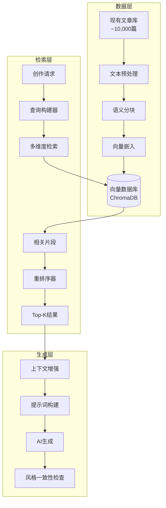
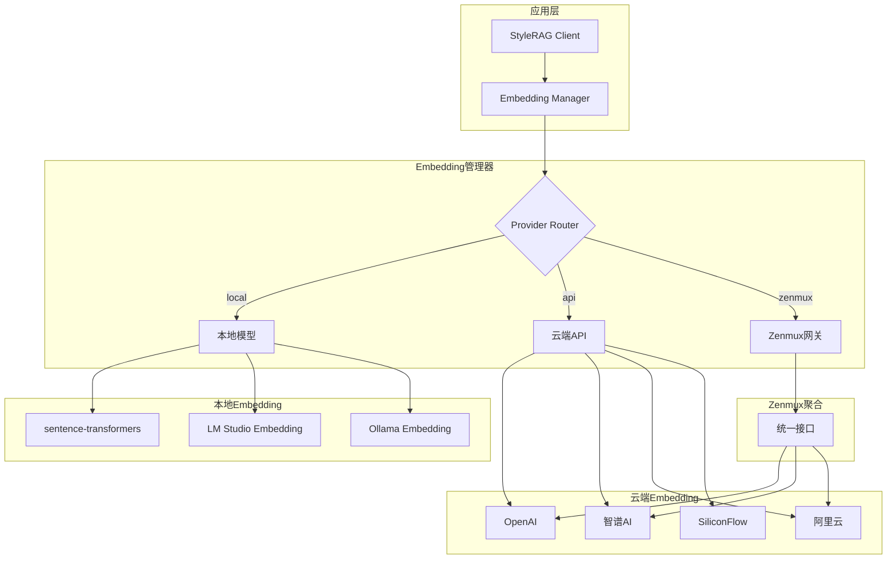
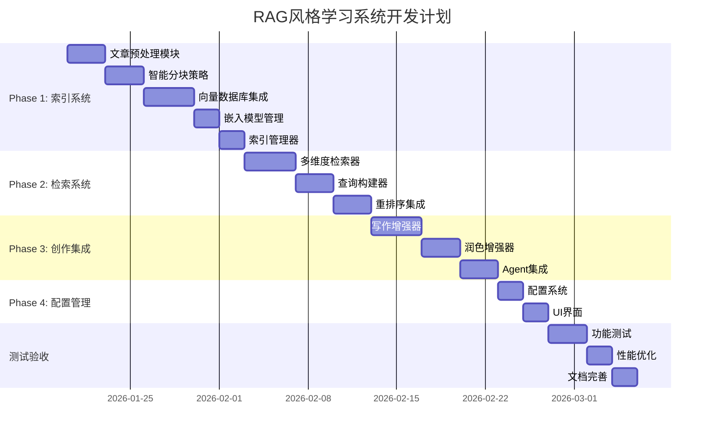

# 方案1: RAG风格学习与创作优化系统
# Strategy 1: RAG-Based Style Learning & Creation Optimization System

**优先级**: ⭐⭐⭐⭐⭐ 极高 | **实施复杂度**: 高 | **预期收益**: 写作质量提升 + Token节省40-80%


---

## 概述

构建基于检索增强生成（RAG）的多功能系统，支持两大核心用例：

1. **风格学习RAG** - 索引用户现有的近万篇文章，学习用词习惯、表达手法、句式结构
2. **创作流程RAG** - 索引大纲、故事线、人物设定等创作素材，按需检索替代全量传递，大幅减少Token消耗

### 核心价值

| 价值维度 | 风格学习RAG | 创作流程RAG |
|---------|------------|------------|
| **主要目标** | 提升写作质量 | 降低Token消耗 |
| **索引内容** | 现有文章库 | 大纲、故事线、人物、世界观 |
| **检索时机** | 写作/润色阶段 | 每章生成前 |
| **预期收益** | 风格一致性+30% | Token -40-60% |

---

## 用例1: 风格学习RAG

通过索引现有文章，让AI在创作时参考和学习用户的写作风格：

- **个性化写作** - 学习用户独特的写作风格，生成更贴近用户习惯的内容
- **用词精准** - 参考现有文章的词汇使用，保持用词一致性
- **表达手法** - 学习比喻、修辞、对话等表达技巧
- **连贯性提升** - 通过检索相似场景，确保描写的一致性

---

## 用例2: 创作流程RAG（Token优化）

> [!IMPORTANT]
> 传统方案中，每次生成章节都需要传递完整的大纲、人物设定、故事线等内容，造成大量Token浪费。
> 通过RAG检索，只传递与当前章节相关的片段，可节省40-60%的Token。

### 传统方案 vs RAG方案对比

```
传统方案（每章传递）:
┌─────────────────────────────────────────────────────┐
│ 完整大纲 (2000 tokens)                               │
│ 完整人物设定 (1500 tokens)                           │
│ 完整世界观 (1000 tokens)                             │
│ 前30章故事线 (3000 tokens)                           │
│ 当前章节故事线 (200 tokens)                          │
├─────────────────────────────────────────────────────┤
│ 总计: ~7700 tokens/章                               │
│ 100章小说: 770,000 tokens 仅用于上下文               │
└─────────────────────────────────────────────────────┘

RAG方案（按需检索）:
┌─────────────────────────────────────────────────────┐
│ 相关大纲片段 (300 tokens) ← 检索Top-3              │
│ 相关人物设定 (400 tokens) ← 检索出场人物            │
│ 相关世界观片段 (200 tokens) ← 检索相关设定          │
│ 相关历史章节 (500 tokens) ← 检索相似场景            │
│ 当前章节故事线 (200 tokens)                          │
├─────────────────────────────────────────────────────┤
│ 总计: ~1600 tokens/章                               │
│ 100章小说: 160,000 tokens (-79%)                    │
└─────────────────────────────────────────────────────┘
```

### 创作素材索引结构

```python
# 创作流程RAG - 索引创作素材
class CreativeContentIndex:
    """创作内容索引 - 用于Token优化"""
    
    def __init__(self, novel_id: str, db_path: str):
        self.novel_id = novel_id
        self.collections = {
            'outline': None,      # 大纲片段
            'characters': None,   # 人物设定
            'worldview': None,    # 世界观设定
            'storylines': None,   # 历史故事线
            'chapters': None,     # 已生成章节摘要
        }
        self._init_collections(db_path)
    
    def index_outline(self, outline: str):
        """索引大纲 - 按章节/弧段分块"""
        chunks = self._chunk_outline(outline)
        # 每个chunk包含: 章节范围、主要事件、涉及人物
        self._add_to_collection('outline', chunks)
    
    def index_characters(self, characters: dict):
        """索引人物设定 - 按人物分块"""
        for name, profile in characters.items():
            chunk = {
                'content': f"【{name}】\n{profile}",
                'metadata': {'name': name, 'type': 'character'}
            }
            self._add_to_collection('characters', [chunk])
    
    def index_storyline(self, chapter_num: int, storyline: str):
        """索引故事线 - 每章一条"""
        chunk = {
            'content': storyline,
            'metadata': {
                'chapter': chapter_num,
                'type': 'storyline'
            }
        }
        self._add_to_collection('storylines', [chunk])
    
    def retrieve_context_for_chapter(self, 
                                      chapter_num: int,
                                      current_storyline: str,
                                      character_names: list) -> dict:
        """为当前章节检索相关上下文"""
        context = {}
        
        # 1. 检索相关大纲片段
        context['outline'] = self._search('outline', 
            query=current_storyline, top_k=3)
        
        # 2. 检索出场人物设定
        context['characters'] = self._search('characters',
            filter={'name': {'$in': character_names}})
        
        # 3. 检索相关历史章节
        context['history'] = self._search('storylines',
            query=current_storyline, 
            filter={'chapter': {'$lt': chapter_num}},
            top_k=5)
        
        # 4. 检索相关世界观
        context['worldview'] = self._search('worldview',
            query=current_storyline, top_k=2)
        
        return context
```

### 集成到创作Agent

```python
# 在 aign_agents.py 中集成RAG检索
class RAGEnhancedWriterAgent:
    """RAG增强的写作Agent"""
    
    def __init__(self, content_index: CreativeContentIndex):
        self.content_index = content_index
    
    def build_context(self, 
                      chapter_num: int,
                      current_storyline: str,
                      character_names: list) -> str:
        """构建RAG增强的上下文（替代全量传递）"""
        
        # 检索相关内容
        retrieved = self.content_index.retrieve_context_for_chapter(
            chapter_num=chapter_num,
            current_storyline=current_storyline,
            character_names=character_names
        )
        
        # 构建精简上下文
        context_parts = []
        
        # 相关大纲（而非完整大纲）
        if retrieved['outline']:
            context_parts.append("## 相关大纲")
            for chunk in retrieved['outline']:
                context_parts.append(chunk['content'])
        
        # 出场人物设定（而非全部人物）
        if retrieved['characters']:
            context_parts.append("## 本章出场人物")
            for chunk in retrieved['characters']:
                context_parts.append(chunk['content'])
        
        # 相关历史章节（而非全部历史）
        if retrieved['history']:
            context_parts.append("## 相关前文")
            for chunk in retrieved['history'][:3]:
                context_parts.append(f"第{chunk['metadata']['chapter']}章: {chunk['content'][:200]}...")
        
        # 当前故事线（完整保留）
        context_parts.append("## 本章故事线")
        context_parts.append(current_storyline)
        
        return "\n\n".join(context_parts)
```

### Token节省效果

| 内容类型 | 传统方案 | RAG方案 | 节省 |
|---------|---------|---------|-----|
| 大纲 | 2000 tokens | 300 tokens | 85% |
| 人物设定 | 1500 tokens | 400 tokens | 73% |
| 世界观 | 1000 tokens | 200 tokens | 80% |
| 历史故事线 | 3000 tokens | 500 tokens | 83% |
| **总计** | **7500 tokens** | **1400 tokens** | **81%** |

> [!TIP]
> 对于长篇小说（100+章），创作流程RAG可节省数十万Token，显著降低API成本。

## 系统架构



---

## 所需模型能力

| 能力 | 是否必需 | 说明 |
|-----|---------|------|
| **基础对话** | ✅ 必需 | 标准文本生成能力 |
| **Embedding API** | ✅ 必需 | 用于文章向量化和相似度检索 |
| **长上下文** | ⚠️ 推荐 | 8K+上下文可容纳更多参考片段 |
| **Function Calling** | ❌ 可选 | 可用于智能检索查询构建 |

> [!NOTE]
> 此方案**强依赖 Embedding API**。推荐使用中文优化的嵌入模型以获得最佳效果。

---

## 提供商兼容性

| 提供商 | Embedding支持 | 推荐模型 | 兼容性 |
|-------|-------------|---------|-------|
| DeepSeek | ❌ 无原生 | 使用外部Embedding | ⚠️ 需配置 |
| OpenRouter | ✅ 有 | text-embedding-3-small | ✅ 完全兼容 |
| Claude | ❌ 无原生 | Voyage AI embedding | ⚠️ 需配置 |
| Gemini | ✅ 有 | text-embedding-004 | ✅ 完全兼容 |
| 智谱AI | ✅ 有 | embedding-3 | ✅ 完全兼容 |
| 阿里云 | ✅ 有 | text-embedding-v2/v3 | ✅ 完全兼容 |
| SiliconFlow | ✅ 有 | BAAI/bge-large-zh | ✅ 完全兼容 |
| LM Studio | ✅ 本地 | nomic-embed-text | ✅ 完全兼容 |
| **Zenmux** | ✅ 有 | 多模型聚合 | ✅ 完全兼容 |

> [!TIP]
> **Zenmux** 作为API聚合网关，支持转发多种Embedding模型请求，可统一管理多个后端Embedding服务。

### 推荐Embedding方案（中文优化）

1. **BAAI/bge-large-zh-v1.5** - 中文最佳，可本地运行
2. **智谱 embedding-3** - API调用，中文原生支持
3. **阿里云 text-embedding-v3** - API调用，高质量中文支持
4. **nomic-embed-text** - 本地运行，多语言支持
5. **Zenmux聚合** - 通过Zenmux网关统一调用多种Embedding服务

---

## 可复用的开源RAG项目

> [!NOTE]
> 以下开源项目提供完整的RAG能力和API接口，可作为本项目的RAG后端或直接集成使用，而非仅用于体验测试。

### 推荐的生产级RAG项目

| 项目 | GitHub | 核心能力 | 集成方式 | 中文支持 |
|-----|--------|---------|---------|---------|
| **RAGFlow** | [infiniflow/ragflow](https://github.com/infiniflow/ragflow) | 深度文档解析、企业级RAG | REST API | ✅ 优秀 |
| **Dify** | [langgenius/dify](https://github.com/langgenius/dify) | 知识库+工作流+API | REST API | ✅ 优秀 |
| **Flowise** | [FlowiseAI/Flowise](https://github.com/FlowiseAI/Flowise) | 可视化RAG流程编排 | REST API | ⚠️ 一般 |

### RAGFlow 集成方案

RAGFlow提供企业级文档理解能力，特别适合处理复杂格式文档：

```python
# 通过RAGFlow API创建知识库并检索
import requests

class RAGFlowClient:
    """RAGFlow API客户端"""
    
    def __init__(self, base_url: str = "http://localhost:9380", api_key: str = ""):
        self.base_url = base_url
        self.api_key = api_key
        self.headers = {"Authorization": f"Bearer {api_key}"}
    
    def create_dataset(self, name: str) -> str:
        """创建知识库"""
        response = requests.post(
            f"{self.base_url}/api/v1/datasets",
            json={"name": name},
            headers=self.headers
        )
        return response.json()["data"]["id"]
    
    def upload_documents(self, dataset_id: str, files: list):
        """上传文档到知识库"""
        for file_path in files:
            with open(file_path, 'rb') as f:
                requests.post(
                    f"{self.base_url}/api/v1/datasets/{dataset_id}/documents",
                    files={"file": f},
                    headers=self.headers
                )
    
    def query(self, dataset_id: str, question: str, top_k: int = 5) -> list:
        """检索相关内容"""
        response = requests.post(
            f"{self.base_url}/api/v1/retrieval",
            json={
                "dataset_ids": [dataset_id],
                "question": question,
                "top_k": top_k
            },
            headers=self.headers
        )
        return response.json()["data"]["chunks"]
```

### Dify 集成方案

Dify提供完整的知识库管理和检索API：

```python
# 通过Dify知识库API检索
class DifyKnowledgeClient:
    """Dify知识库客户端"""
    
    def __init__(self, base_url: str, api_key: str):
        self.base_url = base_url
        self.headers = {"Authorization": f"Bearer {api_key}"}
    
    def search(self, dataset_id: str, query: str, top_k: int = 5) -> list:
        """知识库检索"""
        response = requests.post(
            f"{self.base_url}/v1/datasets/{dataset_id}/retrieve",
            json={"query": query, "top_k": top_k},
            headers=self.headers
        )
        return response.json()["records"]
```

### 选择建议

| 场景 | 推荐方案 |
|-----|---------|
| **已有RAGFlow/Dify部署** | 直接调用其API作为RAG后端 |
| **需要最大灵活性** | 使用本文档的`style-rag`自建方案 |
| **快速验证效果** | 先用Dify/RAGFlow测试，确认后迁移到自建 |
| **企业级文档处理** | RAGFlow（PDF/图片/表格解析能力强） |

## 本地与云端Embedding混合架构

> [!IMPORTANT]
> 为适应不同使用场景，RAG系统支持**本地Embedding**和**云端Embedding**混合使用，用户可根据需求灵活配置。

### 架构设计



### Embedding配置

```python
# style_rag/core/embedding_config.py
"""Embedding配置 - 支持本地/云端/混合模式"""

from dataclasses import dataclass, field
from typing import Optional, Literal
from enum import Enum

class EmbeddingProvider(Enum):
    """Embedding提供商"""
    LOCAL = "local"           # 本地模型
    OPENAI = "openai"         # OpenAI API
    ZHIPU = "zhipu"           # 智谱AI
    ALIYUN = "aliyun"         # 阿里云
    SILICONFLOW = "siliconflow"  # SiliconFlow
    ZENMUX = "zenmux"         # Zenmux聚合网关
    LM_STUDIO = "lm_studio"   # LM Studio本地
    OLLAMA = "ollama"         # Ollama本地

@dataclass
class EmbeddingConfig:
    """Embedding配置"""
    
    # 主要提供商
    provider: EmbeddingProvider = EmbeddingProvider.LOCAL
    
    # 本地模型配置
    local_model: str = "BAAI/bge-large-zh-v1.5"
    local_device: str = "auto"  # auto, cpu, cuda
    
    # 云端API配置
    api_base_url: Optional[str] = None
    api_key: Optional[str] = None
    api_model: str = "text-embedding-3-small"
    
    # Zenmux配置
    zenmux_base_url: str = "http://localhost:8000"
    zenmux_model: str = "embedding-default"
    
    # LM Studio配置
    lm_studio_url: str = "http://localhost:1234/v1"
    lm_studio_model: str = "nomic-embed-text"
    
    # Ollama配置
    ollama_url: str = "http://localhost:11434"
    ollama_model: str = "nomic-embed-text"
    
    # 降级配置（云端不可用时自动降级到本地）
    enable_fallback: bool = True
    fallback_to_local: bool = True
    
    # 批处理配置
    batch_size: int = 32
    max_retries: int = 3
```

### Embedding管理器实现

```python
# style_rag/core/embeddings.py
"""统一Embedding管理器"""

from typing import List, Optional
import numpy as np

class EmbeddingManager:
    """统一的Embedding管理器 - 支持本地/云端/混合"""
    
    def __init__(self, config: EmbeddingConfig):
        self.config = config
        self._local_model = None
        self._api_client = None
        self._initialize()
    
    def _initialize(self):
        """初始化Embedding后端"""
        if self.config.provider == EmbeddingProvider.LOCAL:
            self._init_local_model()
        elif self.config.provider == EmbeddingProvider.LM_STUDIO:
            self._init_lm_studio()
        elif self.config.provider == EmbeddingProvider.OLLAMA:
            self._init_ollama()
        elif self.config.provider == EmbeddingProvider.ZENMUX:
            self._init_zenmux()
        else:
            self._init_api_client()
        
        # 初始化降级备选
        if self.config.enable_fallback and self.config.fallback_to_local:
            self._init_fallback_local()
    
    def _init_local_model(self):
        """初始化本地sentence-transformers模型"""
        from sentence_transformers import SentenceTransformer
        self._local_model = SentenceTransformer(
            self.config.local_model,
            device=self.config.local_device
        )
    
    def _init_lm_studio(self):
        """初始化LM Studio Embedding"""
        from openai import OpenAI
        self._api_client = OpenAI(
            base_url=self.config.lm_studio_url,
            api_key="not-needed"
        )
        self._api_model = self.config.lm_studio_model
    
    def _init_zenmux(self):
        """初始化Zenmux网关"""
        from openai import OpenAI
        self._api_client = OpenAI(
            base_url=self.config.zenmux_base_url,
            api_key=self.config.api_key or "zenmux-key"
        )
        self._api_model = self.config.zenmux_model
    
    def _init_api_client(self):
        """初始化云端API客户端"""
        from openai import OpenAI
        
        base_urls = {
            EmbeddingProvider.OPENAI: "https://api.openai.com/v1",
            EmbeddingProvider.ZHIPU: "https://open.bigmodel.cn/api/paas/v4",
            EmbeddingProvider.ALIYUN: "https://dashscope.aliyuncs.com/compatible-mode/v1",
            EmbeddingProvider.SILICONFLOW: "https://api.siliconflow.cn/v1",
        }
        
        self._api_client = OpenAI(
            base_url=self.config.api_base_url or base_urls.get(self.config.provider),
            api_key=self.config.api_key
        )
        self._api_model = self.config.api_model
    
    def embed(self, texts: List[str]) -> np.ndarray:
        """生成文本嵌入向量"""
        try:
            if self._local_model:
                return self._embed_local(texts)
            else:
                return self._embed_api(texts)
        except Exception as e:
            if self.config.enable_fallback and self._fallback_model:
                print(f"云端Embedding失败，降级到本地: {e}")
                return self._embed_fallback(texts)
            raise
    
    def _embed_local(self, texts: List[str]) -> np.ndarray:
        """使用本地模型嵌入"""
        return self._local_model.encode(
            texts,
            batch_size=self.config.batch_size,
            show_progress_bar=len(texts) > 100
        )
    
    def _embed_api(self, texts: List[str]) -> np.ndarray:
        """使用API嵌入"""
        all_embeddings = []
        
        for i in range(0, len(texts), self.config.batch_size):
            batch = texts[i:i + self.config.batch_size]
            response = self._api_client.embeddings.create(
                model=self._api_model,
                input=batch
            )
            batch_embeddings = [d.embedding for d in response.data]
            all_embeddings.extend(batch_embeddings)
        
        return np.array(all_embeddings)
```

### 使用示例

```python
from style_rag import StyleRAGClient, EmbeddingConfig, EmbeddingProvider

# 方式1: 使用本地Embedding（离线可用，无API费用）
client_local = StyleRAGClient(
    db_path="./my_rag_db",
    embedding_config=EmbeddingConfig(
        provider=EmbeddingProvider.LOCAL,
        local_model="BAAI/bge-large-zh-v1.5"
    )
)

# 方式2: 使用云端API（高质量，需API Key）
client_cloud = StyleRAGClient(
    db_path="./my_rag_db",
    embedding_config=EmbeddingConfig(
        provider=EmbeddingProvider.ZHIPU,
        api_key="your-zhipu-api-key",
        api_model="embedding-3"
    )
)

# 方式3: 使用Zenmux网关（统一管理多个后端）
client_zenmux = StyleRAGClient(
    db_path="./my_rag_db",
    embedding_config=EmbeddingConfig(
        provider=EmbeddingProvider.ZENMUX,
        zenmux_base_url="http://localhost:8000/v1",
        zenmux_model="bge-large-zh",
        api_key="your-zenmux-key"
    )
)

# 方式4: 使用LM Studio本地服务
client_lmstudio = StyleRAGClient(
    db_path="./my_rag_db",
    embedding_config=EmbeddingConfig(
        provider=EmbeddingProvider.LM_STUDIO,
        lm_studio_url="http://localhost:1234/v1",
        lm_studio_model="nomic-embed-text"
    )
)

# 方式5: 云端+本地降级（推荐生产环境）
client_hybrid = StyleRAGClient(
    db_path="./my_rag_db",
    embedding_config=EmbeddingConfig(
        provider=EmbeddingProvider.SILICONFLOW,
        api_key="your-siliconflow-key",
        api_model="BAAI/bge-large-zh-v1.5",
        enable_fallback=True,
        fallback_to_local=True,
        local_model="BAAI/bge-small-zh-v1.5"  # 降级使用小模型
    )
)
```

### 在AI小说生成器中的集成

```python
# AI_Gen_Novel2项目集成示例
from style_rag import StyleRAGClient, EmbeddingConfig, EmbeddingProvider

class RAGEnabledNovelGenerator:
    """支持RAG的小说生成器"""
    
    def __init__(self, config: dict):
        # 根据配置选择Embedding方式
        embedding_config = self._build_embedding_config(config)
        
        self.rag_client = StyleRAGClient(
            db_path=config.get('rag_db_path', './novel_rag_db'),
            embedding_config=embedding_config
        )
    
    def _build_embedding_config(self, config: dict) -> EmbeddingConfig:
        """根据用户配置构建Embedding配置"""
        provider_str = config.get('embedding_provider', 'local')
        
        # 映射提供商
        provider_map = {
            'local': EmbeddingProvider.LOCAL,
            'openai': EmbeddingProvider.OPENAI,
            'zhipu': EmbeddingProvider.ZHIPU,
            'aliyun': EmbeddingProvider.ALIYUN,
            'siliconflow': EmbeddingProvider.SILICONFLOW,
            'zenmux': EmbeddingProvider.ZENMUX,
            'lm_studio': EmbeddingProvider.LM_STUDIO,
        }
        
        return EmbeddingConfig(
            provider=provider_map.get(provider_str, EmbeddingProvider.LOCAL),
            local_model=config.get('local_embedding_model', 'BAAI/bge-large-zh-v1.5'),
            api_key=config.get('embedding_api_key'),
            api_model=config.get('embedding_model'),
            zenmux_base_url=config.get('zenmux_url', 'http://localhost:8000/v1'),
            enable_fallback=config.get('embedding_fallback', True)
        )
```

---

## 技术选型

### 核心组件

| 组件 | 推荐方案 | 备选方案 | 说明 |
|-----|---------|---------|------|
| **向量数据库** | ChromaDB | Milvus Lite, Qdrant | 轻量级，本地优先 |
| **RAG框架** | LlamaIndex | LangChain | 文档索引和检索能力强 |
| **嵌入模型** | bge-large-zh | text-embedding-3-small | 中文优化优先 |
| **重排序** | bge-reranker-large | cross-encoder | 提升检索精度 |

### 依赖包

```txt
# RAG核心依赖
llama-index>=0.10.0
chromadb>=0.4.0
sentence-transformers>=2.2.0

# 可选：重排序支持
FlagEmbedding>=1.2.0  # BGE重排序

# 可选：API嵌入
openai>=1.0.0  # OpenAI/兼容API嵌入
```

---

## 独立项目架构设计

> [!IMPORTANT]
> 此RAG系统设计为**独立项目**，可被多个应用集成使用（如AI小说生成器、写作助手、内容分析工具等）。

### 项目结构

```
style-rag/                          # 独立RAG项目
├── pyproject.toml                  # 项目配置
├── README.md                       # 使用文档
├── requirements.txt                # 依赖清单
│
├── style_rag/                      # 核心包
│   ├── __init__.py
│   ├── core/                       # 核心模块
│   │   ├── config.py               # 配置管理
│   │   ├── embeddings.py           # 嵌入模型管理
│   │   ├── vector_store.py         # 向量存储
│   │   └── chunker.py              # 分块策略
│   │
│   ├── indexing/                   # 索引模块
│   │   ├── article_loader.py       # 文章加载
│   │   ├── preprocessor.py         # 预处理
│   │   └── index_manager.py        # 索引管理
│   │
│   ├── retrieval/                  # 检索模块
│   │   ├── retriever.py            # 检索器
│   │   ├── query_builder.py        # 查询构建
│   │   └── reranker.py             # 重排序
│   │
│   ├── api/                        # API层
│   │   ├── client.py               # 客户端接口
│   │   └── server.py               # HTTP服务(可选)
│   │
│   └── cli/                        # 命令行工具
│       ├── index_articles.py       # 索引命令
│       └── query.py                # 查询命令
│
├── scripts/                        # 实用脚本
│   ├── build_index.py              # 构建索引脚本
│   └── test_retrieval.py           # 测试检索
│
└── examples/                       # 使用示例
    ├── novel_generator/            # AI小说生成器集成
    └── writing_assistant/          # 写作助手集成
```

### 核心API设计

```python
# style_rag/api/client.py
"""StyleRAG客户端 - 统一接口供其他项目调用"""

from typing import List, Dict, Optional
from pathlib import Path

class StyleRAGClient:
    """风格RAG客户端"""
    
    def __init__(self, 
                 db_path: str = "./style_rag_db",
                 embedding_model: str = "BAAI/bge-large-zh-v1.5"):
        """
        初始化RAG客户端
        
        Args:
            db_path: 向量数据库存储路径
            embedding_model: 嵌入模型名称
        """
        self.db_path = Path(db_path)
        self.embedding_model = embedding_model
        self._initialize()
    
    # ==================== 索引API ====================
    
    def index_directory(self, 
                        articles_dir: str,
                        file_patterns: List[str] = ["*.txt", "*.md"],
                        recursive: bool = True) -> Dict:
        """
        索引目录下的所有文章
        
        Args:
            articles_dir: 文章目录路径
            file_patterns: 文件匹配模式
            recursive: 是否递归子目录
            
        Returns:
            索引结果统计
        """
        pass
    
    def index_files(self, file_paths: List[str]) -> Dict:
        """
        索引指定的文件列表
        
        Args:
            file_paths: 文件路径列表
            
        Returns:
            索引结果统计
        """
        pass
    
    def index_texts(self, 
                    texts: List[str], 
                    metadatas: Optional[List[Dict]] = None) -> Dict:
        """
        直接索引文本内容
        
        Args:
            texts: 文本列表
            metadatas: 对应的元数据列表
            
        Returns:
            索引结果统计
        """
        pass
    
    # ==================== 检索API ====================
    
    def search(self,
               query: str,
               top_k: int = 5,
               filter_type: Optional[str] = None,
               min_similarity: float = 0.5) -> List[Dict]:
        """
        语义检索相关片段
        
        Args:
            query: 检索查询
            top_k: 返回数量
            filter_type: 过滤类型(dialogue/description/action)
            min_similarity: 最小相似度阈值
            
        Returns:
            相关片段列表
        """
        pass
    
    def search_by_scene(self,
                        scene_description: str,
                        emotion: str = None,
                        writing_type: str = None,
                        top_k: int = 3) -> List[Dict]:
        """
        按场景检索（专为创作优化）
        
        Args:
            scene_description: 场景描述
            emotion: 情感基调
            writing_type: 写作类型
            top_k: 返回数量
            
        Returns:
            相关片段列表
        """
        pass
    
    # ==================== 管理API ====================
    
    def get_stats(self) -> Dict:
        """获取索引统计信息"""
        pass
    
    def clear_index(self) -> bool:
        """清空索引"""
        pass
    
    def export_index(self, export_path: str) -> bool:
        """导出索引到指定路径"""
        pass
    
    def import_index(self, import_path: str) -> bool:
        """从指定路径导入索引"""
        pass
```

---

## 使用现有文章构建RAG

### 快速开始

#### 1. 安装StyleRAG

```bash
# 方式1: pip安装（发布后）
pip install style-rag

# 方式2: 本地安装
cd style-rag
pip install -e .

# 方式3: 直接使用（开发阶段）
pip install -r requirements.txt
```

#### 2. 准备文章目录

```
my_articles/                    # 你的文章目录
├── 玄幻/                       # 可按类别分目录
│   ├── 斗破苍穹风格_001.txt
│   ├── 斗破苍穹风格_002.txt
│   └── ...
├── 都市/
│   ├── 都市爽文_001.txt
│   └── ...
├── 言情/
│   └── ...
└── 混合文章.txt                # 也可以放在根目录
```

> [!TIP]
> - 支持的文件格式: `.txt`, `.md`, `.epub`(需额外依赖)
> - 建议按风格/类别组织目录，便于后续过滤检索
> - 单个文件大小无限制，系统会自动分块

#### 3. 构建索引

**方式A: 命令行（推荐新手）**

```bash
# 基本用法 - 索引整个目录
python -m style_rag.cli.index_articles \
    --input ./my_articles \
    --output ./my_rag_db

# 指定嵌入模型
python -m style_rag.cli.index_articles \
    --input ./my_articles \
    --output ./my_rag_db \
    --embedding-model "BAAI/bge-large-zh-v1.5"

# 仅索引特定类型
python -m style_rag.cli.index_articles \
    --input ./my_articles \
    --output ./my_rag_db \
    --patterns "*.txt" "*.md"

# 查看索引进度
python -m style_rag.cli.index_articles \
    --input ./my_articles \
    --output ./my_rag_db \
    --verbose
```

**方式B: Python代码**

```python
from style_rag import StyleRAGClient

# 初始化客户端
client = StyleRAGClient(
    db_path="./my_rag_db",
    embedding_model="BAAI/bge-large-zh-v1.5"
)

# 索引整个目录
result = client.index_directory(
    articles_dir="./my_articles",
    file_patterns=["*.txt", "*.md"],
    recursive=True
)

print(f"索引完成: {result['total_files']} 个文件, {result['total_chunks']} 个片段")
```

**方式C: 增量索引**

```python
# 添加新文章到现有索引
client.index_files([
    "./new_articles/新作品_01.txt",
    "./new_articles/新作品_02.txt"
])

# 直接索引文本（不需要文件）
client.index_texts(
    texts=["这是一段精彩的战斗描写...", "月光洒落，她静静站在窗前..."],
    metadatas=[
        {"type": "action", "source": "手动添加"},
        {"type": "description", "source": "手动添加"}
    ]
)
```

#### 4. 测试检索

```bash
# 命令行测试
python -m style_rag.cli.query \
    --db ./my_rag_db \
    --query "激烈的战斗场面" \
    --top-k 3
```

```python
# Python代码测试
results = client.search(
    query="月下相遇，暧昧氛围",
    top_k=5,
    filter_type="description"
)

for i, r in enumerate(results, 1):
    print(f"=== 结果{i} (相似度: {r['similarity']:.2f}) ===")
    print(r['content'][:200])
    print()
```

---

### 文章格式要求

#### 支持的格式

| 格式 | 说明 | 注意事项 |
|-----|------|---------|
| `.txt` | 纯文本 | UTF-8编码 |
| `.md` | Markdown | 自动去除标记符号 |
| `.epub` | 电子书 | 需安装`ebooklib` |

#### 最佳实践

```
# 推荐的文章内容结构（非强制）

第一章 初入修仙界

    林风站在山门前，望着眼前巍峨的建筑群，心中涌起一股莫名的激动。
这里，就是他梦寐以求的天玄宗。

    「你就是今年的新弟子？」一个冷淡的声音从身后传来。

    林风转身，只见一位身着青色道袍的年轻人正打量着自己......
```

> [!NOTE]
> - 系统会自动识别对话、描写、动作等不同类型的内容
> - 篇章标记（如"第X章"）会被用作元数据
> - 空行用于分隔段落，有助于分块质量

---

### 在其他项目中集成

#### 示例1: AI小说生成器集成

```python
# 在 AI_Gen_Novel2 项目中使用
from style_rag import StyleRAGClient

class AINovelGenerator:
    def __init__(self):
        # 初始化RAG客户端
        self.rag_client = StyleRAGClient(
            db_path="./novel_style_db",
            embedding_model="BAAI/bge-large-zh-v1.5"
        )
    
    def generate_chapter(self, storyline, chapter_num):
        # 1. 检索相关风格参考
        references = self.rag_client.search_by_scene(
            scene_description=storyline,
            emotion=self._detect_emotion(storyline),
            writing_type="description",
            top_k=3
        )
        
        # 2. 构建增强提示词
        enhanced_prompt = self._build_prompt_with_references(
            storyline, references
        )
        
        # 3. 调用LLM生成
        return self.llm.generate(enhanced_prompt)
    
    def _build_prompt_with_references(self, storyline, references):
        ref_text = "\n\n".join([
            f"【参考{i+1}】\n{r['content']}" 
            for i, r in enumerate(references)
        ])
        
        return f"""## 写作风格参考
请学习以下片段的用词和表达手法：

{ref_text}

## 本章故事线
{storyline}

## 要求
参考上述风格，创作本章内容。保持用词习惯一致，但不要复制原文。
"""
```

#### 示例2: 通用写作助手集成

```python
# 在写作助手项目中使用
from style_rag import StyleRAGClient

class WritingAssistant:
    def __init__(self, style_db_path: str):
        self.rag = StyleRAGClient(db_path=style_db_path)
    
    def get_writing_inspiration(self, 
                                 current_text: str,
                                 writing_goal: str) -> List[str]:
        """获取写作灵感"""
        results = self.rag.search(
            query=f"{writing_goal}: {current_text[:100]}",
            top_k=5
        )
        return [r['content'] for r in results]
    
    def suggest_expressions(self, 
                            scene: str, 
                            emotion: str) -> List[str]:
        """推荐表达方式"""
        results = self.rag.search_by_scene(
            scene_description=scene,
            emotion=emotion,
            top_k=3
        )
        return [r['content'] for r in results]
```

#### 示例3: HTTP服务方式（跨语言集成）

```bash
# 启动HTTP服务
python -m style_rag.api.server \
    --db ./my_rag_db \
    --port 8080
```

```javascript
// JavaScript客户端调用
async function searchStyles(query) {
    const response = await fetch('http://localhost:8080/search', {
        method: 'POST',
        headers: { 'Content-Type': 'application/json' },
        body: JSON.stringify({
            query: query,
            top_k: 5
        })
    });
    return await response.json();
}
```

---

## 详细实现方案

### Phase 1: 文章索引系统 (预计2周)

#### 1.1 文章预处理模块

```python
# rag/article_preprocessor.py
"""文章预处理器 - 清洗和标准化现有文章"""

import re
from pathlib import Path
from typing import List, Dict, Optional
from dataclasses import dataclass

@dataclass
class ArticleChunk:
    """文章片段"""
    content: str
    metadata: Dict
    chunk_type: str  # paragraph, dialogue, description, action
    
class ArticlePreprocessor:
    """文章预处理器"""
    
    def __init__(self, articles_dir: str):
        self.articles_dir = Path(articles_dir)
        
    def load_articles(self) -> List[Dict]:
        """加载所有文章"""
        articles = []
        for file_path in self.articles_dir.rglob("*.txt"):
            content = file_path.read_text(encoding='utf-8')
            articles.append({
                'file_path': str(file_path),
                'content': content,
                'metadata': self._extract_metadata(file_path, content)
            })
        return articles
    
    def _extract_metadata(self, file_path: Path, content: str) -> Dict:
        """提取文章元数据"""
        return {
            'filename': file_path.name,
            'char_count': len(content),
            'estimated_style': self._detect_style(content),
            'has_dialogue': bool(re.search(r'[「『""].*?[」』""]', content))
        }
    
    def _detect_style(self, content: str) -> str:
        """检测文章风格（简化版）"""
        # 基于关键词和模式检测
        if re.search(r'[修炼|灵气|丹药|仙人]', content):
            return 'xianxia'
        elif re.search(r'[总裁|霸道|爱情|宠]', content):
            return 'romance'
        elif re.search(r'[穿越|系统|重生|金手指]', content):
            return 'system'
        return 'general'
```

#### 1.2 智能分块策略

```python
# rag/smart_chunker.py
"""智能分块器 - 按语义和结构分割文章"""

from llama_index.core.node_parser import (
    SentenceSplitter,
    SemanticSplitterNodeParser
)
from typing import List

class StyleAwareChunker:
    """风格感知分块器"""
    
    def __init__(self, 
                 chunk_size: int = 512,
                 chunk_overlap: int = 50,
                 embed_model = None):
        self.chunk_size = chunk_size
        self.chunk_overlap = chunk_overlap
        self.embed_model = embed_model
        
        # 句子级分割器（备用）
        self.sentence_splitter = SentenceSplitter(
            chunk_size=chunk_size,
            chunk_overlap=chunk_overlap,
            separator="\n"
        )
        
        # 语义分割器（推荐）
        if embed_model:
            self.semantic_splitter = SemanticSplitterNodeParser(
                buffer_size=1,
                breakpoint_percentile_threshold=95,
                embed_model=embed_model
            )
    
    def chunk_article(self, content: str, metadata: Dict) -> List[Dict]:
        """分块文章"""
        chunks = []
        
        # 1. 先按段落分割
        paragraphs = self._split_by_paragraph(content)
        
        for para in paragraphs:
            chunk_type = self._classify_chunk(para)
            
            # 2. 对话单独处理
            if chunk_type == 'dialogue':
                chunks.extend(self._process_dialogue(para, metadata))
            # 3. 描写和叙事保持语义完整
            else:
                chunks.extend(self._process_prose(para, chunk_type, metadata))
        
        return chunks
    
    def _classify_chunk(self, text: str) -> str:
        """分类片段类型"""
        dialogue_ratio = len(re.findall(r'[「『""].*?[」』""]', text)) / max(len(text), 1)
        
        if dialogue_ratio > 0.5:
            return 'dialogue'
        elif re.search(r'(他|她)想|心中|暗道|思索', text):
            return 'inner_monologue'
        elif re.search(r'一道|只见|忽然|突然', text):
            return 'action'
        else:
            return 'description'
    
    def _process_dialogue(self, text: str, metadata: Dict) -> List[Dict]:
        """处理对话片段"""
        # 提取完整对话交互
        dialogues = re.findall(r'[^。！？]*?[「『""].*?[」』""][^。！？]*[。！？]', text)
        return [{
            'content': d,
            'metadata': {**metadata, 'chunk_type': 'dialogue'},
            'chunk_type': 'dialogue'
        } for d in dialogues if len(d) > 20]
    
    def _process_prose(self, text: str, chunk_type: str, metadata: Dict) -> List[Dict]:
        """处理散文/叙事片段"""
        # 使用语义分割保持完整性
        if len(text) <= self.chunk_size:
            return [{
                'content': text,
                'metadata': {**metadata, 'chunk_type': chunk_type},
                'chunk_type': chunk_type
            }]
        
        # 按句子分割
        return self._split_long_text(text, chunk_type, metadata)
```

#### 1.3 向量数据库管理

```python
# rag/vector_store.py
"""向量存储管理 - ChromaDB集成"""

import chromadb
from chromadb.config import Settings
from typing import List, Dict, Optional
from pathlib import Path

class StyleVectorStore:
    """风格向量存储"""
    
    def __init__(self, 
                 persist_dir: str = "./rag_db",
                 collection_name: str = "article_styles"):
        self.persist_dir = Path(persist_dir)
        self.persist_dir.mkdir(parents=True, exist_ok=True)
        
        # 初始化ChromaDB
        self.client = chromadb.PersistentClient(
            path=str(self.persist_dir),
            settings=Settings(anonymized_telemetry=False)
        )
        
        self.collection = self.client.get_or_create_collection(
            name=collection_name,
            metadata={"hnsw:space": "cosine"}
        )
    
    def add_chunks(self, chunks: List[Dict], embeddings: List[List[float]]):
        """添加文章片段到向量库"""
        ids = [f"chunk_{i}_{hash(c['content'])}" for i, c in enumerate(chunks)]
        documents = [c['content'] for c in chunks]
        metadatas = [c['metadata'] for c in chunks]
        
        self.collection.add(
            ids=ids,
            embeddings=embeddings,
            documents=documents,
            metadatas=metadatas
        )
    
    def query(self, 
              query_embedding: List[float],
              n_results: int = 5,
              filter_dict: Optional[Dict] = None) -> List[Dict]:
        """查询相似片段"""
        results = self.collection.query(
            query_embeddings=[query_embedding],
            n_results=n_results,
            where=filter_dict,
            include=["documents", "metadatas", "distances"]
        )
        
        return [{
            'content': doc,
            'metadata': meta,
            'similarity': 1 - dist  # 转换距离为相似度
        } for doc, meta, dist in zip(
            results['documents'][0],
            results['metadatas'][0],
            results['distances'][0]
        )]
    
    def get_collection_stats(self) -> Dict:
        """获取集合统计信息"""
        return {
            'total_chunks': self.collection.count(),
            'persist_dir': str(self.persist_dir)
        }
```

---

### Phase 2: 检索增强系统 (预计2周)

#### 2.1 多维度检索器

```python
# rag/style_retriever.py
"""风格检索器 - 多维度检索相关片段"""

from typing import List, Dict, Optional
from dataclasses import dataclass

@dataclass
class RetrievalQuery:
    """检索查询"""
    scene_description: str          # 当前场景描述
    character_names: List[str]      # 相关人物
    emotion_tone: str               # 情感基调
    writing_type: str               # 写作类型：dialogue/description/action
    style_preference: Optional[str] # 风格偏好

class StyleRetriever:
    """风格检索器"""
    
    def __init__(self, 
                 vector_store: StyleVectorStore,
                 embed_model,
                 reranker = None):
        self.vector_store = vector_store
        self.embed_model = embed_model
        self.reranker = reranker
    
    def retrieve(self, 
                 query: RetrievalQuery,
                 top_k: int = 5) -> List[Dict]:
        """多维度检索"""
        
        # 1. 构建语义查询
        semantic_query = self._build_semantic_query(query)
        query_embedding = self.embed_model.encode(semantic_query)
        
        # 2. 初步检索
        candidates = self.vector_store.query(
            query_embedding=query_embedding,
            n_results=top_k * 3,  # 多检索用于重排序
            filter_dict=self._build_filter(query)
        )
        
        # 3. 重排序（如果可用）
        if self.reranker and len(candidates) > top_k:
            candidates = self._rerank(semantic_query, candidates, top_k)
        
        return candidates[:top_k]
    
    def _build_semantic_query(self, query: RetrievalQuery) -> str:
        """构建语义查询字符串"""
        parts = [query.scene_description]
        
        if query.emotion_tone:
            parts.append(f"情感氛围：{query.emotion_tone}")
        if query.writing_type:
            parts.append(f"写作类型：{query.writing_type}")
        if query.character_names:
            parts.append(f"相关人物：{'、'.join(query.character_names)}")
            
        return " ".join(parts)
    
    def _build_filter(self, query: RetrievalQuery) -> Optional[Dict]:
        """构建过滤条件"""
        if query.writing_type:
            return {"chunk_type": query.writing_type}
        return None
    
    def _rerank(self, query: str, candidates: List[Dict], top_k: int) -> List[Dict]:
        """使用交叉编码器重排序"""
        pairs = [(query, c['content']) for c in candidates]
        scores = self.reranker.predict(pairs)
        
        # 按分数排序
        sorted_candidates = sorted(
            zip(candidates, scores),
            key=lambda x: x[1],
            reverse=True
        )
        return [c for c, _ in sorted_candidates[:top_k]]
```

#### 2.2 检索查询生成器

```python
# rag/query_builder.py
"""查询构建器 - 从创作上下文生成检索查询"""

class CreativeQueryBuilder:
    """创作查询构建器"""
    
    def build_query_from_context(self,
                                  storyline: str,
                                  current_chapter_summary: str,
                                  character_states: Dict,
                                  writing_phase: str) -> RetrievalQuery:
        """从创作上下文构建检索查询"""
        
        # 分析当前写作需求
        scene_description = self._extract_scene(storyline, current_chapter_summary)
        character_names = list(character_states.keys())[:3]  # 取主要人物
        emotion_tone = self._infer_emotion(storyline)
        writing_type = self._infer_writing_type(writing_phase)
        
        return RetrievalQuery(
            scene_description=scene_description,
            character_names=character_names,
            emotion_tone=emotion_tone,
            writing_type=writing_type
        )
    
    def _extract_scene(self, storyline: str, summary: str) -> str:
        """提取场景描述"""
        # 取故事线的关键描述
        sentences = storyline.split('。')
        key_sentences = [s for s in sentences if len(s) > 10][:2]
        return '。'.join(key_sentences)
    
    def _infer_emotion(self, text: str) -> str:
        """推断情感基调"""
        emotion_keywords = {
            '激动': ['战斗', '冲突', '愤怒', '激动'],
            '温馨': ['温暖', '爱', '拥抱', '微笑'],
            '紧张': ['危险', '逃跑', '追杀', '紧张'],
            '悲伤': ['离别', '死亡', '泪', '悲'],
            '神秘': ['秘密', '未知', '古老', '神秘']
        }
        
        for emotion, keywords in emotion_keywords.items():
            if any(kw in text for kw in keywords):
                return emotion
        return '平稳'
    
    def _infer_writing_type(self, phase: str) -> str:
        """推断写作类型"""
        type_mapping = {
            'opening': 'description',
            'development': 'action',
            'dialogue': 'dialogue',
            'climax': 'action',
            'ending': 'description'
        }
        return type_mapping.get(phase, 'description')
```

---

### Phase 3: 创作集成 (预计1.5周)

#### 3.1 RAG创作增强器

```python
# rag/creative_enhancer.py
"""创作增强器 - 将RAG集成到创作流程"""

class RAGCreativeEnhancer:
    """RAG创作增强器"""
    
    def __init__(self,
                 retriever: StyleRetriever,
                 query_builder: CreativeQueryBuilder):
        self.retriever = retriever
        self.query_builder = query_builder
    
    def enhance_writing_prompt(self,
                                base_prompt: str,
                                storyline: str,
                                chapter_summary: str,
                                character_states: Dict,
                                writing_phase: str) -> str:
        """增强写作提示词"""
        
        # 1. 构建检索查询
        query = self.query_builder.build_query_from_context(
            storyline=storyline,
            current_chapter_summary=chapter_summary,
            character_states=character_states,
            writing_phase=writing_phase
        )
        
        # 2. 检索相关片段
        relevant_chunks = self.retriever.retrieve(query, top_k=3)
        
        # 3. 构建参考上下文
        reference_context = self._format_references(relevant_chunks)
        
        # 4. 增强原始提示词
        enhanced_prompt = self._inject_references(base_prompt, reference_context)
        
        return enhanced_prompt
    
    def _format_references(self, chunks: List[Dict]) -> str:
        """格式化参考片段"""
        if not chunks:
            return ""
        
        references = ["## 写作风格参考\n"]
        references.append("以下是与当前场景相似的优秀写作片段，请参考其用词和表达手法：\n")
        
        for i, chunk in enumerate(chunks, 1):
            chunk_type = chunk['metadata'].get('chunk_type', 'general')
            references.append(f"### 参考{i} ({chunk_type})")
            references.append(f"```\n{chunk['content']}\n```\n")
        
        references.append("\n> 请学习上述参考的用词习惯、句式结构和表达手法，但要创作全新的内容。\n")
        
        return "\n".join(references)
    
    def _inject_references(self, base_prompt: str, references: str) -> str:
        """将参考内容注入提示词"""
        if not references:
            return base_prompt
        
        # 在写作指令之前插入参考
        if "# 写作要求" in base_prompt:
            return base_prompt.replace(
                "# 写作要求",
                f"{references}\n# 写作要求"
            )
        else:
            return f"{references}\n\n{base_prompt}"
```

#### 3.2 润色增强集成

```python
# rag/embellishment_enhancer.py
"""润色增强器 - 为润色阶段提供风格参考"""

class RAGEmbellishmentEnhancer:
    """RAG润色增强器"""
    
    def __init__(self, retriever: StyleRetriever):
        self.retriever = retriever
    
    def get_style_references_for_embellishment(self,
                                                draft_content: str,
                                                target_style: str) -> str:
        """获取润色风格参考"""
        
        # 1. 分析草稿内容
        content_analysis = self._analyze_draft(draft_content)
        
        # 2. 构建针对性查询 - 着重表达手法
        queries = []
        
        # 对话润色参考
        if content_analysis['has_dialogue']:
            queries.append(RetrievalQuery(
                scene_description=content_analysis['dialogue_context'],
                character_names=[],
                emotion_tone=content_analysis['emotion'],
                writing_type='dialogue'
            ))
        
        # 描写润色参考
        if content_analysis['has_description']:
            queries.append(RetrievalQuery(
                scene_description=content_analysis['description_context'],
                character_names=[],
                emotion_tone=content_analysis['emotion'],
                writing_type='description'
            ))
        
        # 3. 检索并合并参考
        all_references = []
        for query in queries:
            refs = self.retriever.retrieve(query, top_k=2)
            all_references.extend(refs)
        
        # 4. 格式化润色参考
        return self._format_embellishment_references(all_references, target_style)
    
    def _analyze_draft(self, content: str) -> Dict:
        """分析草稿内容"""
        has_dialogue = bool(re.search(r'[「『""]', content))
        has_description = len(content) > 200 and not has_dialogue
        
        return {
            'has_dialogue': has_dialogue,
            'has_description': has_description,
            'dialogue_context': self._extract_dialogue_context(content) if has_dialogue else "",
            'description_context': content[:200] if has_description else "",
            'emotion': self._detect_emotion(content)
        }
    
    def _format_embellishment_references(self, refs: List[Dict], style: str) -> str:
        """格式化润色参考"""
        if not refs:
            return ""
        
        output = ["## 润色风格参考\n"]
        output.append(f"目标风格: {style}\n")
        output.append("参考以下片段的修辞手法、句式变化和用词精准度：\n")
        
        for i, ref in enumerate(refs, 1):
            output.append(f"【参考{i}】\n{ref['content']}\n")
        
        return "\n".join(output)
```

---

### Phase 4: 配置与管理 (预计0.5周)

#### 4.1 RAG配置管理

```python
# rag/rag_config.py
"""RAG系统配置"""

from dataclasses import dataclass, field
from typing import Optional, List

@dataclass
class RAGConfig:
    """RAG配置"""
    
    # 启用开关
    enabled: bool = False
    
    # 文章库路径
    articles_dir: str = "./articles"
    
    # 向量数据库配置
    vector_db_path: str = "./rag_db"
    collection_name: str = "article_styles"
    
    # 嵌入模型配置
    embedding_provider: str = "local"  # local, openai, zhipu, aliyun
    embedding_model: str = "BAAI/bge-large-zh-v1.5"
    
    # 检索配置
    top_k: int = 3
    similarity_threshold: float = 0.6
    enable_reranking: bool = True
    reranker_model: str = "BAAI/bge-reranker-large"
    
    # 分块配置
    chunk_size: int = 512
    chunk_overlap: int = 50
    
    # 集成配置
    enhance_writing: bool = True
    enhance_embellishment: bool = True
    
    # 性能配置
    batch_size: int = 32  # 嵌入批处理大小
    max_cached_embeddings: int = 10000

# 默认配置
DEFAULT_RAG_CONFIG = RAGConfig()
```

#### 4.2 UI集成

```python
# 在 app.py 中添加RAG配置界面

def create_rag_config_ui():
    """创建RAG配置界面"""
    
    with gr.Accordion("📚 RAG风格学习系统", open=False):
        rag_enabled = gr.Checkbox(
            label="启用RAG风格学习",
            value=False,
            info="使用现有文章库增强写作风格"
        )
        
        articles_dir = gr.Textbox(
            label="文章库路径",
            value="./articles",
            info="包含参考文章的目录"
        )
        
        with gr.Row():
            embedding_provider = gr.Dropdown(
                label="嵌入模型提供商",
                choices=["local", "openai", "zhipu", "aliyun", "siliconflow"],
                value="local"
            )
            embedding_model = gr.Textbox(
                label="嵌入模型",
                value="BAAI/bge-large-zh-v1.5"
            )
        
        with gr.Row():
            top_k = gr.Slider(
                label="检索数量",
                minimum=1, maximum=10, value=3, step=1
            )
            similarity_threshold = gr.Slider(
                label="相似度阈值",
                minimum=0.3, maximum=0.9, value=0.6, step=0.05
            )
        
        with gr.Row():
            enhance_writing = gr.Checkbox(label="增强写作", value=True)
            enhance_embellishment = gr.Checkbox(label="增强润色", value=True)
        
        with gr.Row():
            index_status = gr.Textbox(
                label="索引状态",
                value="未索引",
                interactive=False
            )
            index_btn = gr.Button("🔄 重建索引", variant="secondary")
        
    return {
        'rag_enabled': rag_enabled,
        'articles_dir': articles_dir,
        'embedding_provider': embedding_provider,
        'embedding_model': embedding_model,
        'top_k': top_k,
        'similarity_threshold': similarity_threshold,
        'enhance_writing': enhance_writing,
        'enhance_embellishment': enhance_embellishment,
        'index_status': index_status,
        'index_btn': index_btn
    }
```

---

## 文件结构

```
rag/
├── __init__.py
├── rag_config.py              # 配置管理
├── article_preprocessor.py    # 文章预处理
├── smart_chunker.py           # 智能分块
├── vector_store.py            # 向量存储
├── embedding_manager.py       # 嵌入模型管理
├── style_retriever.py         # 风格检索
├── query_builder.py           # 查询构建
├── creative_enhancer.py       # 创作增强
├── embellishment_enhancer.py  # 润色增强
└── index_manager.py           # 索引管理

# 集成修改
aign_agents.py                 # 集成RAG增强器
app.py                         # 添加RAG配置UI
dynamic_config_manager.py      # 添加RAG配置项
```

---

## 实施计划

### 总体时间线



### 里程碑

| 阶段 | 里程碑 | 预计完成 | 验收标准 |
|-----|--------|---------|---------|
| Phase 1 | 索引系统上线 | 第2周末 | 能够索引10000篇文章，查询响应<100ms |
| Phase 2 | 检索系统就绪 | 第4周末 | 相似度检索准确率>80%，重排序生效 |
| Phase 3 | 创作集成完成 | 第5.5周末 | 写作和润色均可调用RAG增强 |
| Phase 4 | 系统可用 | 第6周末 | UI可配置，文档完整 |

---

## 预期效果

### 写作质量提升

| 维度 | 提升幅度 | 说明 |
|-----|---------|------|
| **用词精准度** | +30-40% | 参考现有优秀用词 |
| **表达丰富度** | +25-35% | 学习多样化表达 |
| **风格一致性** | +50% | 保持整体风格统一 |
| **对话自然度** | +20-30% | 参考真实对话片段 |

### 性能开销

| 资源 | 开销 | 说明 |
|-----|-----|------|
| **磁盘空间** | 500MB-2GB | 向量数据库存储 |
| **内存使用** | +200-500MB | 嵌入模型和缓存 |
| **首次索引** | 1-3小时 | 10000篇文章 |
| **检索延迟** | +50-100ms/次 | 每次创作增加 |

---

## 风险与缓解

| 风险 | 影响 | 缓解措施 |
|-----|-----|---------|
| **嵌入模型质量** | 检索不准确 | 使用中文优化模型，加入重排序 |
| **索引时间过长** | 用户体验差 | 增量索引，后台处理 |
| **参考内容干扰** | 生成内容重复 | 明确提示"参考但不复制" |
| **内存占用过大** | 系统不稳定 | 分批加载，LRU缓存 |

---

## 验证计划

### 自动化测试

```bash
# 1. 单元测试
pytest rag/tests/ -v

# 2. 索引性能测试
python rag/tests/test_indexing_performance.py --articles-dir ./test_articles

# 3. 检索准确性测试
python rag/tests/test_retrieval_accuracy.py --test-queries ./test_queries.json
```

### 手动验证

1. **索引验证**
   - 导入1000篇测试文章
   - 验证索引完成后可查询
   - 检查向量数据库文件生成

2. **检索验证**
   - 输入测试场景描述
   - 验证返回的参考片段相关性
   - 检查不同chunk_type的过滤效果

3. **写作质量对比**
   - 生成相同章节：RAG开启 vs 关闭
   - 对比用词丰富度和表达多样性
   - 评估整体风格一致性

---

## 后续扩展

1. **多风格库**：支持多个独立的文章库，用户可按需切换
2. **在线学习**：将新生成的优质内容自动加入索引
3. **风格迁移**：从一种风格学习并迁移到另一种
4. **协作过滤**：结合用户反馈优化检索结果

---

> [!IMPORTANT]
> 此优化方案是提升写作质量的关键性升级。建议在Phase 1完成后进行阶段性验收，确保基础索引系统稳定后再进入检索和集成阶段。
